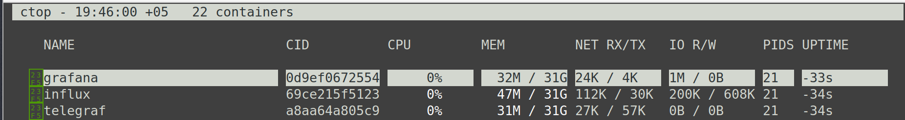
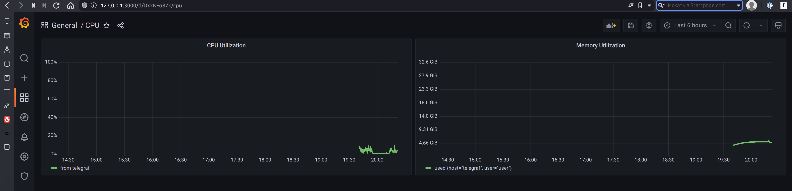
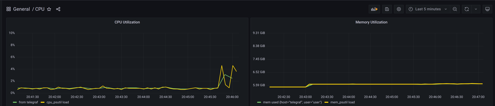
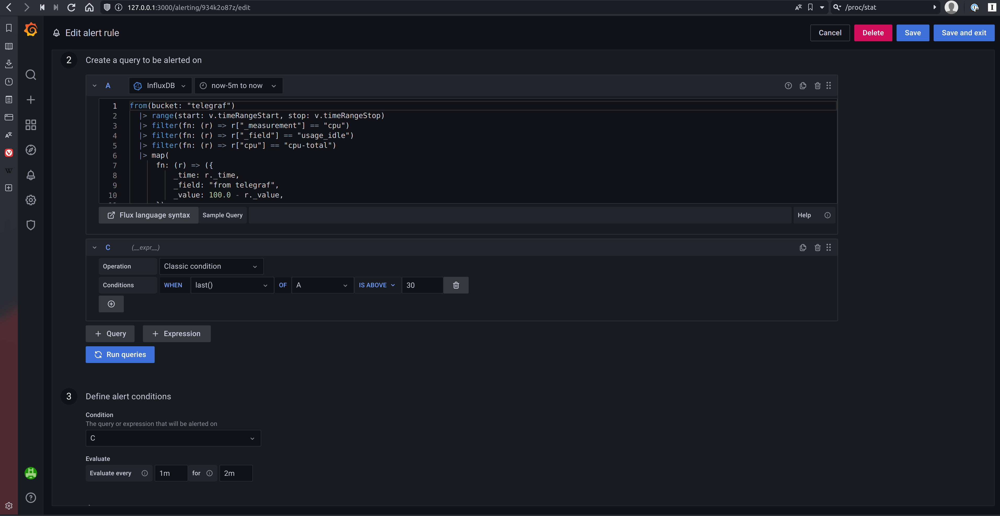
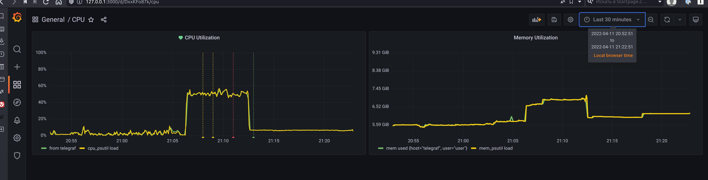
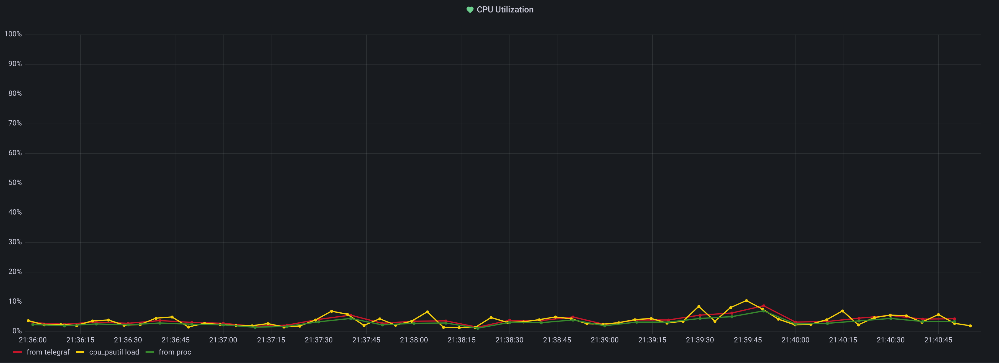
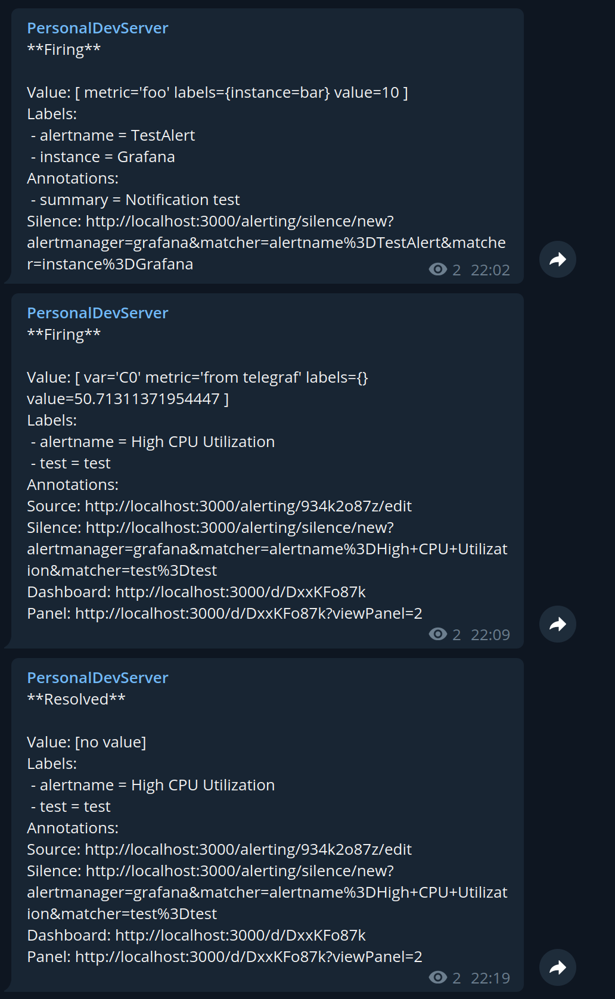

# Курс Мониторинг. Домашнее задание #2 #

## Задание 1 ##

### Задание: ###

Прислать скриншот запущенных контейнеров. Скрин терминала, с отображением списка, запущенных контейнеров. И отображение
дашборда со свежими отметками времени на момент выполнения задания. Можете сделать видео с рабочего стола. Как итог у
вас должен работать telegraf из коробки с собиранием информации по ЦПУ и памяти с отображением на дашборде.

### Решение: ###

#### 1 Скриншот контейнеров ####

#### 2 Дашборд ####

## Задание 2 ##

### Задание: ###

Взять любую реализацию вашего скрипта на Python, bash,PS (один скрипт, одна ось на ваш выбор) , который вы делали на ДЗ
№1 и подключить в telegraf. Собрать метрики по ЦПУ и памяти. 1 значение - загрузка ЦПУ в % и 1 значение - использование
памяти, либо в GB, либо в % к общему объему. Почему по 1 значению? Чтобы не зарываться в обилии цифр. Не надо частоту,
количество ядер и прочее.

### Решение: ###

#### 1 Скрипт ####

[Ссылка](custom_metrics/src/custom_metrics.py)

#### 2 Дашборд ####

Зеленая - метрики с телеграфа Желтая - метрика с псутила

#### 3 Описание ####

Скрипт заработал - только взял библиотеку для более простой отправки в телеграф, вместо вывода в консоль.

## Задание 3 ##

### Задание: ###

Скриншот настройки триггера. Скриншот графика загрузки ЦПУ с отметками триггеров. Описание и скрипты нагрузки.

### Решение: ###

#### 1 Настройки триггера ####

Не получилось нагрузить систему на 80% понизил порог до 30%

#### 2 Дашборд ####

#### 3 Описание скрипта нагрузки ####

Запустил конвертацию фильма с ffmpeg - получилось загрузить до 50%

## Задание 4 ##

### Задание: ###

Сравнить точность собираемых данных 3-мя методами. Сделать анализ, описать кратко, что увидели, выводы. Скриншот
дашборда с графиками.

### Решение: ###

#### Dashboard ####

#### Описание: ####

Метрики с /proc/stat показывают меньшую утилизацию, но в точности коррелируют с метриками от телеграфа, метрики с
псутила показвают более точные значения в конкретный период телеграф - усредненные за этот период

## Задание 5: ##

### Задание: ###
Бонус к задаче #2. Сделать уведомление о сработке триггера в telegram
Решение. Скриншот сработки триггера.

### Решение ###

Раньше точно помню что была возможность прислать прям скрин дашборда в канал - сейчас не вижу, где это настроить